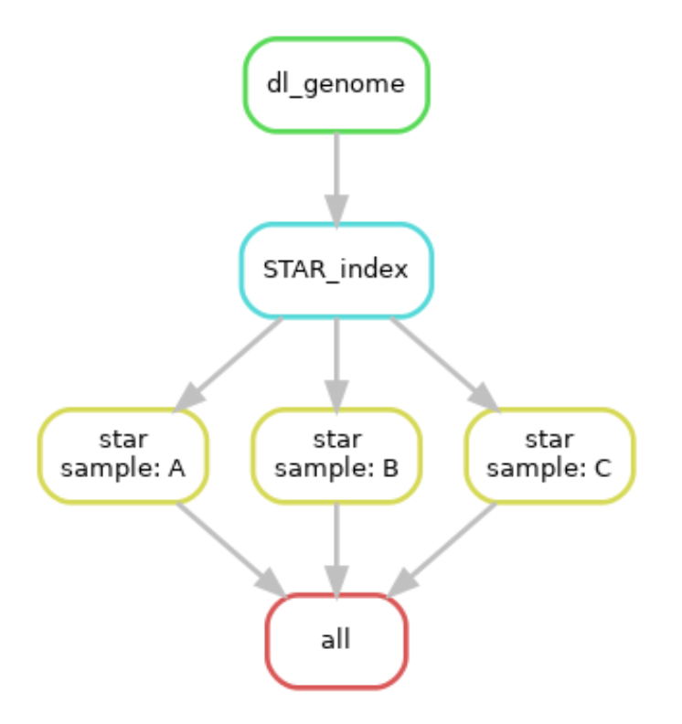
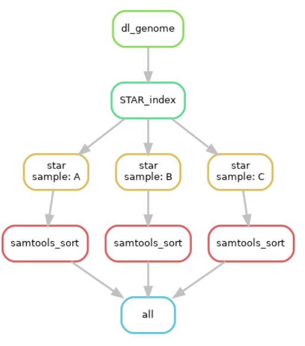

# Project 1 - Discussion Questions
Since we’ve used the first project as practice, these questions are meant to
help me assess how well I’ve conveyed some of the material as well as challenge
you to think conceptually about some of the underlying science. All of these
questions can be answered in a few sentences so do your best to be concise.

Remember, I will evaluate and give you feedback on your answers and allow you to
resubmit. As long as you address all of the comments in your resubmission, you
will receive full credit for this first project.

Open a Rstudio session to work on these questions. You may display any included
images by clicking on the `run current chunk` option for any r blocks that have
an `include_graphics` command in knitr. 

## Snakemake

Consider the following sample snakemake workflow and assume the files A.fq,
B.fq, and C.fq exist in the current working directory. (N.B. Some of these
commands in shell may not technically run, but the logic of the snakefile is
correct)

```
fa_fn = ‘ncbi_dataset/data/GCF_000001635.27/chr19.fa
gtf_fn= ‘ncbi_dataset/data/GCF_000001635.27/genomic.gtf
star_index = ‘Chr19_STAR_index’
FILES = [‘A’, ‘B’, ‘C’]

rule all:
	input:
		expand(‘{sample}.Aligned.out.bam’, sample=FILES)

rule dl_genome:
	output:
		fa = fa_fn,
		gtf = gtf_fn
	shell:
		‘’’
		datasets download genome accession GCF_000001635.27 
    –include gtf, genome
    –chromosomes 19
    
		unzip ncbi_dataset.zip
		‘’’

rule STAR_index:
	input:
		fa = fa_fn,
		gtf = gtf_fn,
	output:
		index=directory(star_index)
	threads: 4
	shell:
		‘’’
		STAR –runMode genome generate \
		–genomeDir {output.index} \
		–genomeFastaFiles {input.fa} \
		–sjdbGTFfile {input.gtf}
		‘’’
		
rule star:
	input:
		fq=’{sample}.fq’,
		index=’Chr19_STAR_index’
	output:
		‘{sample}.Aligned.out.bam’
	params:
		prefix = ‘{sample}.’
	shell:
		‘’’
		STAR –genomeDir {input.index} \
    –readFilesIn {input.fq} \
    –outSAMtype BAM Unsorted \
    –outFileNamePrefix {params.prefix}
    ‘’’
```

1. We’ve talked in class about how you can represent snakemake workflows visually.
Technically speaking, snakemake creates a directed acyclic graph that represents
the workflow. Draw the DAG for this sample snakemake workflow. Boxes indicate
the rules, and arrows indicate dependencies. Make this diagram in whatever
software you'd like and save it to this repo. Fill in the following code with the
name of the file you created and it will display it here in this markdown.

```{r, your image here}

```


2. Write a valid snakemake rule that would run samtools sort on the outputs from
rule star. Name the outputs of this rule with the extension _sorted.bam.

rule samtools_sort: input: bam=“{sample}.Aligned.out.bam” output: sorted_bam =“{sample}_sorted.bam” shell: “““samtools sort -o {output.sorted_bam} {input.bam}”“”


3. Assume that we change our rule all input to be the following:
	
		expand(‘{samples}_sorted.bam’, samples=FILES)	

Re-draw the DAG assuming your rule from part 2 works as expected. Display it 
here using the following code:

```{r, DAG2}

```


## RNAseq

1. List the major high-level steps of a basic RNAseq experiment to look for
differentially expressed genes. At each step, list what data you need to perform
each step and what format they are in (if applicable). At minimum, there are 4
essential steps.

(a)Collect RNA samples from different biological conditions (e.g., treatment and control). Make cDNA libraries from the RNA samples. Make sure to at least have 3 replicates

(b)Using the cDNA libraries, perform high-throughput sequencing to generate .fastq files for each of the samples and their replicates.

(c)Perform FastQC to know more about the sample you’re dealing with and also to validate the sequencing experiment.

(d)Align the .fastq files to the Reference genome using STAR to generate .bam files

(e)Use samtools to sort the .bam file and generate counts data for each for the samples using Verse.

(f)Make a counts matrix by combining the samples together employing .

(g)Use DeSeq2, EdgeR, limma-voom normalization methods to normalize the counts data. Set up contrasts and use the aforesaid methods to perform Differential expression and find the differentially expressed genes specific to the contrast.


2. Consider the following FastQC plot.

```{r}
knitr::include_graphics("fastqc_plot.png")
```


2a. What aspect of the data does this plot show?

This plot shows the distribution of GC content across all the sequences in comparison to a theoretical distribution where an ideal distribution of GC content is expected (around 50%). The shape of theoretical distribution line helps assess whether the actual distribution deviates from the expected rules of base pairings.

Here, we can see two peaks in our sequences, one sharp peak around 40% and another one, less sharply, around 80% mean GC content. Deviations from the theoretical distribution line indicate biases, non-random patterns, or other factors influencing the GC content in our data set.


2b. Make an interpretation of this plot assuming the data type was RNASeq.

The red line shows two peaks suggesting that there are two distinct populations of RNA sequences in the sample, one with a GC content around 40% and another around 80%. This could be due to the presence of different types of RNAs. It could also indicate some form of contamination or bias in the sequencing process.

The blue line (Theoretical Distribution) represents the expected GC content distribution under a random model. The discrepancy between the red and blue lines suggests that the GC content in the RNA-Seq data does not follow a random distribution, which is expected as GC content varies across different organisms and different types of RNA.


2c. Do you think this plot indicates there was a problem with the dataset?
Explain your answer.

The presence of two distinct peaks in the GC content distribution (around 40% and 80%) is unusual for a single organism’s transcriptome, which typically shows a single, more or less bell-shaped distribution. This could suggest that the RNA-Seq data contains sequences from different sources, such as contamination or a mixed sample from multiple organisms.

The significant deviation of the actual GC content from the theoretical distribution could indicate a non-random representation of transcripts. This could be due to various factors, including GC bias in the sequencing process, degradation of the RNA sample, or the presence of specific types of RNA (like rRNA) that are overrepresented in the sample.


3. What is a splice-aware aligner? When is it important to use a splice-aware
aligner?

A tool designed for accurate alignment of RNA sequences to a reference genome, considering splice junctions during RNA splicing. It is crucial for analyzing RNA-Seq data, particularly in studying gene expression, alternative splicing, and identifying novel transcripts or fusion genes. The use of splice-aware aligners ensures precise mapping of reads spanning exon-exon junctions, and also provides insights of alternative splicing events and isoform diversity within genes. It can also be used to identify fusion genes or chimeric transcripts resulting from rearrangements in the genome.


4. What does a “gene-level” count as produced by VERSE or any other counting
tool in a RNAseq experiment represent?

The gene-level count reflects how many RNA-seq reads are aligned to each specific gene in the reference genome.By counting the number of reads associated with each gene, we can infer the relative abundance of transcripts and quantify the expression levels of genes in a particular sample. Gene-level counts are often measured in raw counts, representing the discrete number of reads that align to each gene. Gene-level counts serve as the basis for downstream analyses, such as identifying differentially expressed genes, pathway analysis, and functional annotation.


5. In your own words, briefly describe what information the matching GTF for a
reference genome stores.

The matching GTF file for a reference genome stores information about the gene and transcript features present in the genome. It includes details such as the genomic coordinates of exons, introns, transcription start sites, and stop codons. The GTF file provides information on the gene structure, including the relationships between different features, such as coding sequences (CDS), untranslated regions (UTRs), and splice junctions.


6. When counting alignments using VERSE or any other utility, why do we need to
provide the matching reference genome GTF file?

The matching reference genome GTF file is crucial when counting alignments in RNA-seq analysis because it contains essential information about gene annotations, structures, and splice junctions. This information enables accurate mapping of reads to specific genomic features, facilitates quantification of gene expression, and enhances the biological interpretation of RNA-seq data.


7. Let’s pretend that this was a GSEA result from an experiment where we treated
293T cells with a drug and compared changes in gene expression to wild-type
cells treated with a vehicle control. The differential expression results are
relative to the control cells (i.e. a positive fold change means a gene is
upregulated upon treatment with the drug)

Assume the following result is statistically significant with a positive NES
(normalized enrichment score) and that it represents a GSEA experiment performed
on the entire list of genes discovered in the experiment ranked by
log2FoldChange (i.e. genes that are “upregulated” in the cells treated with drug
are on the “left” and genes that are “downregulated” due to treatment are on the
“right”).

```{r}
knitr::include_graphics("gsea_plot.png")
```


7a. Form a valid interpretation / conclusion of the results shown in the plot
given the above setup.


The gene set being analyzed here is associated with the acute inflammatory response. The positive Normalized Enrichment Score (NES) suggests that this gene set is significantly upregulated in the 293T cells treated with the drug compared to the control cells.

The enrichment profile (green line) shows a peak near the left side of the plot, which corresponds to genes being most upregulated due to the drug treatment. The black vertical lines (hits) represent individual genes in the acute inflammatory response gene set. The concentration of hits on the left side of the plot further supports that these genes are upregulated upon drug treatment.

The lower part of the plot shows the ranking metric scores, with the red section indicating positively correlated genes and the blue section indicating negatively correlated genes. 

In conclusion, the drug treatment appears to significantly induce the acute inflammatory response in 293T cells, as evidenced by the upregulation of related genes. This could imply that the drug has a pro-inflammatory effect on these cells.


7b. Now consider that all of the genes driving the enrichment are all activators
of the inflammatory pathway. Does your interpretation change and if so, how?

If all the genes driving the enrichment are known activators of the inflammatory pathway, this strengthens the conclusion that the drug treatment is inducing an acute inflammatory response in the 293T cells. Specifically, it suggests that the drug is triggering the upregulation of genes that actively promote inflammation. This could mean that the drug has a pro-inflammatory effect on these cells, potentially enhancing their immune response. This might be beneficial or detrimental, depending on the context. For example, in the context of an infection, enhancing the inflammatory response could help the body fight off the pathogen. However, in other contexts, such as autoimmune diseases, this could exacerbate the disease symptoms.


7c. Finally, consider that all of the genes driving the enrichment all function
to inhibit inflammation. Does your interpretation change and if so, how?

In this case, the upregulation of these genes in the 293T cells treated with the drug suggests that the drug is inducing a response that suppresses or mitigates inflammation. This could mean that the drug has an anti-inflammatory effect on these cells. In the context of autoimmune diseases or conditions characterized by excessive inflammation, a drug promoting the anti-inflammatory pathways could help alleviate symptoms.

## O’Meara et al. Transcriptional Reversion of Cardiac Myocyte Fate During
Mammalian Cardiac Regeneration. Circ Res. Feb 2015. PMID: 25477501


1. Write out a methods section describing what steps of the analysis you performed
and which tools you used. Style this section as you would find a methods section
in a scientific publication. Remember to include the important details that
would allow a third party to reproduce your exact analysis. You can safely
exclude details that do not affect the underlying results.

`Original data source`

O’Meara et al. Transcriptional Reversion of Cardiac Myocyte Fate During Mammalian Cardiac Regeneration. Circ Res. Feb 2015. PMID: 25477501

`RNA-Seq Data Processing`

Raw RNA-Seq data in FASTQ format was obtained for samples at 4 different time points (‘AD’, ‘P0’, ‘P4’, and ‘P7’), each with two replicates (‘rep1’ and ‘rep2’). The sequencing data was paired-end and so we have two reads (Forward - R1 and Reverse - R2)essentially making it 16 sample files.

`Quality Control`

Quality control analysis was performed using the FastQC (v0.12.1) on each of the 16 individual FASTQ file. This analysis aimed to assess the sequencing data quality, identify potential issues, and generate individual FastQC reports for each sample and it’s replicates.

MultiQC(version 1.19) was then employed to aggregate and summarize the results from FastQC for all samples and replicates. MultiQC was configured to generate a comprehensive HTML report for an overall assessment of data quality.

`Read Alignment and BAM File Generation`

Paired-end RNA-Seq reads were aligned to the indexed mouse genome using STAR(2.7.11b). The alignment process was conducted separately for each sample and replicate. This yielded 8 files and the resulting aligned reads were saved as BAM files.

`Quality Assessment`

SAMtools was utilized to generate summary statistics for the aligned BAM files. The samtools flagstat command was applied to produce text files containing alignment statistics for each sample and replicate.

`Transcript Quantification`

The verse tool was utilized for transcript quantification. This step involved running the verse rule, which took the BAM files and the GTF annotation as inputs, producing transcript quantification text (.txt) files for each sample.

`Data Integration and Processing`

To consolidate the individual transcript quantification files, a python script was used. This rule concatenated exon-level expression data (Counts data) for all samples into a single .csv file.

Be defining a python script to parse the gene annotation data, we identified the gene annotation information from the downloaded GTF file. 

`Final Output`

Lastly, a python script to filter the counts data was executed to filter the expression matrix. Filtering was done across the rows such that there was atleast one non-zero entry in the rows. 

Loading Counts Data: The count matrix was read into R using the read.csv function. This matrix contains the filtered read counts for each gene across different samples.

Sample Information: Sample information was organized such that it contains the sample names and its corresponding timepoints.

Differential Expression Analysis: Differential expression analysis was performed using the DESeq function on the DESeqDataSet object and a contrast was defined to compare gene expression between conditions “AD” and “P0.”

DE Results for the Specified Contrast: Differential expression results for the specified contrast were extracted using the results function and was saved as a tibble. 

Gene Set Enrichment Analysis (FGSEA): Gene expression results were ordered based on positive log2 fold change, and a ranked list was created for FGSEA. C2 genes from MSIGDB were used for gene set enrichment analysis and the top and last 10 pathways from the FGSEA analysis were examined.


2. Why did the authors perform RNAseq on these specific samples? What was their
goal in doing so?

The main goals of the RNA sequencing analyses were to define the transcriptional changes underlying cardiac myocyte differentiation and determine if regeneration involves reversion of this differentiated state, as well as to identify potential regulators of regeneration based on the transcriptome data. Defining these transcriptional signatures and regulatory pathways provides key insights into promoting cardiac myocyte proliferation and heart regeneration.


3. Using either your GSEA results OR your replication of Figure 1D, draw a conclusion
about the main result this RNAseq experiment shows. Do your results generally
agree with those of the original publication?

Yes, majority of the results from paper seem to be agreeable. We can see that the genes like Tcap(Titin Cap) showed pronounced increases in expression over the course of differentiation reflecting sarcomere assembly and organization during cardiac myocyte differentiation and maturation.


4. List at least two reasons why your results may be **slightly** different than
those found in the original publication.

While using VERSE, we quantified the reads by using the raw read counts (Counting overlapping reads),whereas in the research paper, they found the counts data by using FPKM.

After making the counts matrix, we filtered across rows to remove genes with zero counts for all samples. This might not be essentially the same as how the authors of this paper might have filtered their counts data.

We used DeSeq2 normalization to normalize the data. The authors might have used a different normalization method like EdgeR or limma-voom.

For pathway analysis, we used the genes from MSIGDB. The authors used GO terms. This might not lead to different results but could be a reason for potential variation in the gene-names we observe.
